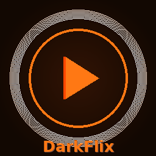

<p align="center">
  
</p>
<div align="center">
  <h1>🎬 DarkFlix Desktop</h1>
  <p><strong>Freedom to Stream — Dark Edition</strong></p>
</div>

<p align="center">
  
  
  
  
  
</p>

---

## ✨ Features

- 🟠 **Orange Dark Theme** — Beautiful custom UI throughout
- 🚀 **Latest WebView2** — Best performance and compatibility
- 🎞️ **Native 4K Playback** — Hardware decoding via MPV
- 🌈 **HDR Support** — Full HDR with MPV
- 🔊 **Dolby Atmos** — All MPV advanced audio features
- 🖼️ **Picture in Picture** — Floating mini-player
- 💬 **Discord Rich Presence** — Show what you're watching
- 🌀 **Torrent & Magnet** — Play directly from torrents
- 🔄 **Auto-Updater** — Always stay up to date
- 📁 **Local File Playback** — Drag & drop any video file
- 💼 **Portable Mode** — No install needed

---

## 📥 Download

Go to [**Releases**](../../releases) and download the latest:

| File | Description |
|------|-------------|
| `DarkFlix-X.X.X-x64.exe` | Windows 64-bit |
| `DarkFlix-X.X.X-x86.exe` | Windows 32-bit |

---

## 🚀 Release (أمر واحد)

```powershell
git tag v5.0.27 && git push origin v5.0.27
```

GitHub Actions يبني x64 + x86 وينشر الـ Release تلقائياً.

---

## 🏗️ Build from Source

### Prerequisites
- Visual Studio 2022 (C++ workload)
- CMake ≥ 3.16
- Ninja
- vcpkg
- Node.js

### Steps

```powershell
git clone https://github.com/Project1155/T-desktop
cd T-desktop

# Install vcpkg deps
vcpkg install openssl:x64-windows-static curl:x64-windows-static `
  nlohmann-json:x64-windows-static microsoft-webview2:x64-windows-static `
  wil:x64-windows-static

# Build
cmake -G Ninja -DCMAKE_BUILD_TYPE=Release `
  -DCMAKE_TOOLCHAIN_FILE="$env:VCPKG_ROOT\scripts\buildsystems\vcpkg.cmake" `
  -DVCPKG_TARGET_TRIPLET=x64-windows-static `
  -B cmake-build-release-x64 -S .
cmake --build cmake-build-release-x64 --parallel
```

---

## 📄 License

Based on [stremio-community-v5](https://github.com/Zaarrg/stremio-community-v5) — modified and rebranded as DarkFlix.
